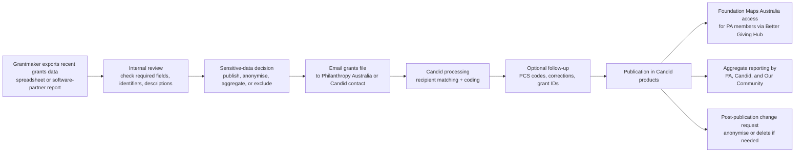

# Foundation Maps Australia

## Executive summary

Foundation Maps Australia is a joint Philanthropy Australia–Candid initiative that uses Candid’s grants-data infrastructure to show **who is funding what and where** across Australia. In current official Philanthropy Australia guidance, access to the live tool is **through the Better Giving Hub and limited to Philanthropy Australia members**; the Better Giving Hub itself is described as exclusive to members at **all membership levels**. Membership is currently marketed to a broad philanthropic and not-for-profit audience, not only foundations. Published 2026 membership prices start at **AU$700 + GST** for CONNECT, rising to **AU$7,500 + GST** for IMPACT. I found **no separate current FMA access fee** on Philanthropy Australia’s public pages. citeturn2view2turn2view3turn2view1turn20view0turn20view5

The contribution model is **opt-in**. Philanthropy Australia says FMA depends on funders choosing to share their grants data, and its public guidance instructs organisations to **export their most recent grants data to a spreadsheet and email the file**. Candid’s equivalent guidance is substantially more detailed: submit one grant per row, include at least the required fields, and preferably report more richly using either a simplified or complete template. Some grants-management systems have built-in export reports; Philanthropy Australia specifically mentions **Grant Toolbox** and **SmartyGrants and Gifts**, while Candid’s wider eReporting ecosystem also supports integrations such as Foundant. citeturn2view4turn2view3turn5view2turn14view0turn15view2turn3view0turn11view1

The **minimum documented grant fields** are recipient name and location, currency, amount, amount type, fiscal year, and description. The **recommended additional fields** include a unique transaction ID, recipient identifier and identifier type, grant title, program area, subject, population served, support strategy, transaction type, area served, fund type, and duration. Other documented fields include postcode, start and end dates, fiscal sponsor, fund name and subtype, recipient URL and aliases, and a “Candid Project” field. On the consumption side, Candid’s APIs also expose structured search by funder, recipient, year, amount, subject, population, support strategy, transaction type, and location, and use **GeoNames** for geospatial identifiers in relevant APIs. citeturn5view2turn14view0turn15view0turn15view1turn19view0turn39view0turn42search0turn42search3

The biggest structural limitation is **coverage**. Australia-specific coverage appears to be fundamentally **grant-centred and self-reported/partner-reported**, not a compulsory national register of all philanthropic flows. Candid explicitly states that, outside the United States, grants data is primarily self-reported by funders or contributed by data partners and therefore represents an **unknown portion** of grantmaking in those countries. Candid also cautions researchers not to assume any one funder-year represents the full scope of an organisation’s grantmaking. That limitation aligns with Australian sector commentary: the ANZTSR submission to the Productivity Commission described Foundation Maps Australia as a member-access tool whose data is provided only by bodies willing to share their particulars. citeturn19view0turn25view2

Privacy and governance are partly documented and partly opaque. Philanthropy Australia’s public materials say it, Candid and Our Community may produce **aggregate granting data reports** from information supplied to FMA. Candid’s grants-sharing FAQ says any data sent for publication should be treated as public unless the organisation has anonymised, aggregated, or removed sensitive details first; email is **not** a secure channel for sensitive grants data. Candid offers mechanisms to anonymise or remove previously shared grants, with suppression typically occurring within one to two weeks and full deletion within one month. However, I found **no public Australia-specific FMA data-sharing agreement, NDA, or detailed contributor-facing ownership clause**. The clearest downstream licensing position is in Candid’s API and custom-dataset terms, which state that **Candid owns the compiled data products** and tightly restrict redistribution and derivative commercial use. citeturn2view4turn6view0turn6view1turn37view0turn17view5turn17view7

For an organisation considering participation, the practical conclusion is straightforward: Foundation Maps Australia can be valuable for **landscape analysis, peer benchmarking, collaboration scouting, and board-level communications**, but it should be approached as a **controlled, member-access, opt-in grants dataset** rather than a complete public infrastructure layer. Before participating, an organisation should clarify its disclosure policy, sensitive-grant handling, update frequency, identifier quality, taxonomy/coding approach, current access rights, and downstream reuse terms with Philanthropy Australia and Candid. citeturn32view0turn25view3turn26search1turn22search17

## Detailed findings

| Dimension | What the reviewed official and sector sources say | What this means in practice |
|---|---|---|
| **Viewing access** | Current Philanthropy Australia guidance says FMA is available through the **Better Giving Hub**. The Better Giving Hub is **exclusive to Philanthropy Australia members at all membership levels**. Membership is marketed to organisations and individuals across the philanthropic and not-for-profit sectors. citeturn2view2turn2view3turn2view1 | The lowest documented current route to access is a Philanthropy Australia membership. |
| **Public vs members-only** | Current access pages describe member-only access, but Philanthropy Australia’s timeline and 2019 annual report refer to a **“public data dashboard”** or a public snapshot of giving. citeturn2view2turn2view3turn21search0turn33view1 | There is evidence of a historical public-facing dashboard snapshot, but the present public documentation points to member-only live access. |
| **Contributor model** | Philanthropy Australia says FMA is “all about participation” and reaches full value only if funders share data. The upload workflow is **export grants to a spreadsheet and email the grants file**. Candid broadly invites funders to share grantmaking data directly as well. citeturn2view3turn2view4turn5view2turn5view3 | Viewing access and data contribution should be treated as separate questions; the tool is opt-in, not compulsory. |
| **Eligibility** | Membership is open to family foundations, corporations, for-purpose organisations, and individuals. Current public FMA pages do **not clearly state** whether a non-member Australian funder can submit data solely for inclusion without obtaining Better Giving Hub access. citeturn2view1turn2view2turn2view4 | If a non-member funder wants to contribute, that point should be confirmed directly with Philanthropy Australia/Candid. |
| **Reporting method** | Candid’s documented method is **one grant per row in a spreadsheet**, using either a simplified or complete template, emailed to Candid. Philanthropy Australia’s Australia-specific page says export the most recent grants data to a spreadsheet and email it. Some systems have built-in export reports; PA names **Grant Toolbox** and **SmartyGrants and Gifts**. Foundant documents a broader Candid eReporting flow through GLM. citeturn14view0turn15view2turn2view4turn3view0turn11view1 | Spreadsheet export is the clearly documented submission path. I found no public Australia-specific self-service upload portal or submission API. |
| **Validation and coding** | Candid says processing takes **up to 10 business days** and includes **recipient matching** and **coding** if coding is not provided. Grants are coded automatically with expert review, and organisations can include PCS codes or use a taxonomy crosswalk for more control. citeturn14view0turn5view2turn19view0 | Data quality depends heavily on clean identifiers and strong descriptive text. |
| **Frequency** | Candid encourages **quarterly** submission, with at least **annual** updates as a minimum. Older guidance also notes many funders report once a year or as grants are approved. citeturn6view3turn14view0 | Quarterly is the best-documented operating cadence for a timely dataset. |
| **Submitted data fields** | Required, recommended, and additional fields are publicly documented by Candid, including recipient identifiers, categorical coding, geography, durations, and aliases. The minimum data Candid needs to load a grant are funder name, recipient name, location, fiscal year, and amount. citeturn5view2turn14view0turn15view0turn15view1turn19view0 | FMA can hold much richer data than a basic grants list if the contributor supplies it. |
| **Export and reuse** | Philanthropy Australia’s public FMA pages do **not document member export options** such as CSV or API access from the FMA interface. Separately, Candid offers commercial **Grants API** access and **custom datasets** in CSV, JSON, and pipe-delimited text, with tight licence limits on redistribution. citeturn39view1turn40view0turn17view5turn17view7 | Do not assume FMA gives members open data export rights; if reuse matters, obtain the terms in writing. |

The documented current access model is therefore best described as **member-access for viewing, voluntary opt-in for data contribution, and commercial/licensed pathways for broader downstream data reuse**. The principal ambiguity is historical and practical rather than conceptual: Philanthropy Australia’s archival materials show a public dashboard snapshot existed, but the **current** public pages no longer document that public route. citeturn2view2turn2view3turn21search0turn33view1

## Submission and publication flow

The clearest public workflow comes from reading Philanthropy Australia’s Australia-specific upload guidance together with Candid’s grants-sharing FAQ and Candid’s how-to guide. That merged process is shown below. citeturn2view4turn5view2turn14view0turn15view2

A few points in that flow are especially important. First, the official submission channel is **email plus spreadsheet**, not a documented Australia-specific API. Secondly, Candid warns that **email is not a secure means of transferring sensitive data**, so any grants that should not be public should be anonymised, aggregated, or removed **before** submission. Thirdly, corrections and takedowns are possible later, but the public guidance treats after-the-fact deletion as an exception rather than the normal privacy control. citeturn2view4turn6view0turn6view1

## Data fields, taxonomy, and coverage

The **exact publicly documented fields** are richer than Philanthropy Australia’s Australia pages alone suggest, because most of the schema is specified in Candid’s grants-sharing documentation. The required fields are: **recipient name, recipient street address, recipient city, recipient state/province, recipient country, currency, amount, amount type, fiscal year, and grant description**. The highly recommended fields are: **transaction ID, recipient ID, recipient ID type, grant title, grant program area, grant subject(s), grant population(s) served, grant support strategies, transaction type, geographic area served, fund type, and grant duration**. The additional documented fields are: **recipient postal code, grant start date, grant end date, fiscal sponsor, fund name, fund subtype, recipient URL, recipient AKA, recipient DBA, recipient FKA, and Candid Project**. citeturn14view0turn15view0turn15view1

At a higher level, Candid says it needs at least **funder name, recipient name, location, fiscal year, and grant amount** to load grant data into its products, but funder-direct reporting can add much richer data such as **grant title, program area, detailed description, subject area, population served, and geographic area served**. Philanthropy Australia’s launch materials also show the practical search/filter layer expected in FMA: grant, grantmaker, grant recipient location, subject area, support strategy, organisation name, year, size, keyword, grantmaker type, and transaction type. citeturn19view0turn32view0

For **project codes and identifiers**, the closest publicly documented fields are the **Transaction ID** (the unique grant ID in the funder’s system) and the **Candid Project** field. For Australian entities, Candid’s guide explicitly gives **Australian Business Number** as an example recipient ID type. I found **no public Australia-specific field list for DGR endorsement, ACNC registration class, tax status, recipient email address, or phone number** in the FMA grant-sharing materials. Those items may exist elsewhere in Candid’s wider organisational data products, but they are **not documented as part of the public FMA grants-upload schema**. citeturn15view1turn39view1turn41search11

On geography, the upload schema is address-based and area-served-based rather than latitude/longitude-based. Candid’s API documentation shows that its systems use **GeoNames** to identify where an organisation, grant, or news article is located or geographically represents, and location searches can be scoped to **funder**, **recipient**, or **area served**. That means contributors submit ordinary location data, while Candid handles the normalised geospatial layer downstream. citeturn39view0turn42search3

The taxonomy is also clear. Candid’s **Philanthropy Classification System** has five facets: **subject, population served, support strategy, transaction type, and organisation type**, with an additional geographic-area-served layer. Candid can auto-code grants from title, description, and program area; it can also apply recipient organisation coding where grant text is too sparse. In the Australian ecosystem, Our Community says its **CLASSIE-AU** taxonomy is based on PCS and is already used in external projects such as Foundation Maps Australia, which helps explain how Australian grants software and classification practice can feed into the same mapping environment. citeturn19view0turn25view4

Coverage is the most important constraint. Philanthropy Australia’s and Candid’s contribution pages consistently describe this as **grants data**. Candid’s broader systems can represent multiple transaction types, and the Grants API can search by transaction code, but the Australia-specific reporting workflow is still framed as **export your grants file** and share your **grants data**. In practical terms, this means Foundation Maps Australia should be treated as a **grant-centric** dataset; other support forms such as in-kind support, sponsorships, regranting structures, or impact-investment-like instruments are not the core documented contribution mode unless a contributor encodes them in a way Candid’s transaction model can process. citeturn2view4turn5view2turn42search0

Historical coverage has grown over time, but current totals are not published on the core access pages. At launch in 2018, Philanthropy Australia reported **8,700 grants worth $552 million to more than 3,660 recipients**. Its timeline says the 2019 dashboard represented **more than 13,000 grants contributing over $840 million**, and the 2020 annual report says data representing **over 14,860 grants contributing over $984 million** had been shared in Foundation Maps Australia. These numbers are useful as historical markers, but they do **not** prove current completeness. Candid’s grants-data fact sheet is explicit that, outside the United States, grants data represents an **unknown portion** of grantmaking and that researchers should not assume year-over-year completeness for a specific funder. citeturn32view0turn21search0turn33view2turn19view0

Two further interpretive limitations deserve attention. First, **grant amounts may be paid or authorised**, and multi-year authorised grants are attributed to the year they were authorised, with duration recorded separately if available. Secondly, Candid warns that population coding does **not** infer demographic identity from geography and cannot capture intersectional identities cleanly. Both issues matter if an organisation expects FMA outputs to support precise sector-wide comparisons or equity analysis. citeturn19view0

## Governance, privacy, licensing, and costs

The governance model is only partly transparent in public materials. Philanthropy Australia states that **Philanthropy Australia, Candid and Our Community may research and produce aggregate granting data reports** from information supplied to FMA. That is the clearest documented statement of secondary use on the Australia-specific page. Philanthropy Australia’s privacy policy also says it may share personal information with employees, contractors, other grant-making organisations, and service providers, including some located in the **USA**, and says it uses security measures such as **encryption, access controls, firewalls, and backups**. citeturn2view4turn37view0

Candid’s grants-sharing FAQ is more operationally specific. It says organisations should assume that **any data sent for sharing will be published in Candid platforms** unless they have removed or anonymised sensitive details first. It also states plainly that **email is not a secure means of transferring sensitive data** and that sensitive data should be anonymised, aggregated, or removed before sharing. For sensitive grants, Candid documents a spectrum of controls: anonymous recipient naming, progressively broader location suppression, exclusion of program area/title/description, anonymous funder naming, and fully aggregate reporting by issue area and geography. citeturn6view0turn6view2

Opt-out and correction are documented, although in a reactive form. Candid asks organisations to email corrections and include grant IDs. If grants must later be changed due to security risks, Candid says anonymisation or deletion can be requested by email. It indicates that anonymised records may be temporarily suppressed while modifications are made, generally appearing within **up to two weeks**, and that deletion requests are suppressed in products within **one to two weeks** and deleted from databases within **one month**. Candid also says deleted grants that were removed for security reasons may **not** be re-added later even if the risk recedes. citeturn6view0turn6view1

On **consent**, the primary upload instructions do **not** set out a blanket grantee-consent requirement. However, Candid’s own good-practice article on sensitive grants data says some funders explicitly seek **grantee input or consent**, for example via an opt-in box in the grant agreement process, and that at minimum grantees should understand where and how grant data will be used. For high-risk portfolios, that is a practical governance benchmark even if it is not a hard submission rule. citeturn43view0

On **data ownership and reuse**, the public FMA pages are thin. I did **not** find a public Australia-specific FMA contributor agreement, NDA, or ownership clause for raw submitted data. What is public and explicit are Candid’s downstream product licences. Candid’s **API terms** state that Candid remains the sole owner of the Candid APIs and Candid Data and prohibit republishing, redistribution, data-mining, scraping, or creating derivative competitive databases. Candid’s **custom dataset licence** similarly states that the dataset content remains the property of Candid and is licensed on a limited, non-exclusive, non-transferable basis. citeturn17view7turn17view5

For **export options**, there is a sharp distinction between submission and downstream commercial access. The contribution workflow is based on exporting internal grants data **out of a grants-management system into a spreadsheet**. By contrast, Candid’s commercial access products include a **Grants API** starting at **US$6,000**, and **custom datasets** starting at **US$3,500**, available in **CSV, JSON, or pipe-delimited text**, with one-time or refreshed delivery through **SFTP, S3, Snowflake, or WRDS**. None of those commercial Candid routes are publicly presented as the same thing as FMA membership access, and Philanthropy Australia’s FMA pages do not document an FMA-member CSV or JSON export right. citeturn39view1turn40view0turn2view4

Costs on the Philanthropy Australia side are more concrete. Current published annual membership fees are **AU$700 + GST** for CONNECT, **AU$1,700 + GST** for ENGAGE Individual, **AU$3,500 + GST** for ENGAGE Organisation, and **AU$7,500 + GST** for IMPACT. Because the Better Giving Hub is exclusive to members at all levels and FMA sits inside that hub, the safest reading is that **FMA access is bundled into membership**. I found **no published separate FMA fee**, no published per-seat pricing for FMA, and no published contributor charge. citeturn20view0turn20view2turn20view5turn2view2

## Risks, commentary, and recommendations

The positive case for Foundation Maps Australia is well established in sector messaging. Philanthropy Australia called the launch a **“game-changer for strategic giving”** and said users would be able to see where grants are going, identify who else funds their areas of interest, and discover potential collaboration partners. Community Foundations Australia describes it as a tool that demonstrates **who is giving what and where** and can be used to identify **gaps in funding**. Perpetual’s Philanthropy Toolkit later cited Foundation Maps Australia as an example funding map for **landscape analysis**. Our Community’s case study with The Channel also shows that FMA can act as one of several useful inputs for cause-area funding analysis. citeturn32view0turn22search17turn26search1turn25view3

The critiques are equally important. The ANZTSR submission to the Productivity Commission argued that Australian philanthropic data remains limited and noted that Foundation Maps Australia is offered to **members** and depends on data supplied only by those willing to share their particulars. Our Community’s account of using Foundation Maps Australia alongside ACNC and other datasets said that **linking the datasets together was particularly challenging**. Those are not minor complaints: they go directly to representativeness, interoperability, and research-grade completeness. citeturn25view2turn25view3

For an organisation considering participation, the practical recommendations are:

- **Treat participation as a data-governance project, not just a portal access decision.** Before submitting anything, decide what counts as publishable, what must be anonymised, and what should never leave your systems. Candid’s own guidance assumes publication by default and warns that email is insecure for sensitive grants. citeturn6view0turn6view2
- **Aim higher than the minimum 10 required fields.** The strongest value comes from adding identifiers, geography, title/programme data, subject/population/support coding, and duration, because those fields improve matching, coding, filtering, and analytical usefulness. citeturn15view0turn15view1turn19view0
- **Adopt a regular refresh cycle, ideally quarterly.** That is the clearest documented best practice, and it reduces the lag between your internal reality and the public/member-facing map. citeturn6view3turn14view0
- **Clarify unresolved contractual points in writing before joining or sharing.** In particular, ask Philanthropy Australia/Candid for the current public-vs-member visibility model, contributor agreement, data ownership language, deletion/retention terms, seat/user rules, and any member export rights. The public pages do not answer those questions completely. citeturn2view2turn2view4turn17view5turn17view7
- **If your organisation works with high-risk grantees, build grantee notification or consent into your grant workflow.** That is not set out as a hard public rule, but Candid’s own responsible-data guidance clearly points in that direction. citeturn43view0

**Open questions / limitations.** The public record is strong on the **general Candid grants-sharing model** and the **current Philanthropy Australia access model**, but weaker on the Australia-specific contractual layer. In the material reviewed, I found no public FMA NDA, no public Australia-specific API submission documentation, no documented current public dashboard URL, and no public statement of FMA-member export rights. Some of the technical field detail also comes from **Candid-wide** documentation and a mirrored Candid how-to guide rather than a bespoke Australian user manual, so organisations should treat those points as **best available public evidence**, not necessarily the full private operating rules of Foundation Maps Australia. citeturn2view4turn3view0turn5view2turn14view0turn17view5turn17view7